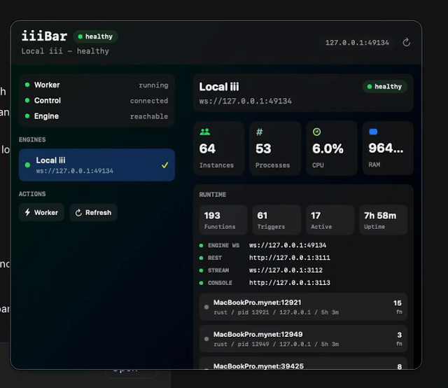

# iiiBar

iiiBar is an experimental macOS menu bar for iii Engine.



The design rule is strict: the macOS app is only a thin host. Profiles, health checks, runtime summaries, OpenTelemetry summaries, recent logs, traces, alerts, diagnostics, and local engine lifecycle actions live behind iii functions in the `iiibar::*` namespace.

## Engine Boundary

iiiBar never changes iii Engine. It does not add engine functions, modify engine protocol, patch engine source, or require engine migrations.

This project stays external:

- `worker/` registers `iiibar::*` functions and calls existing `engine::*` primitives.
- `mac/` builds the native macOS menu bar binary and calls only `iiibar::*`.
- Future CLI or packaged binaries must keep the same boundary.

## Layout

- `worker/` - iii-native worker exposing `iiibar::*` functions.
- `mac/` - SwiftUI menu bar host that only invokes `iiibar::*`.

## Functions

- `iiibar::profiles::list`
- `iiibar::profiles::save`
- `iiibar::engines::status`
- `iiibar::engines::start`
- `iiibar::engines::stop`
- `iiibar::runtime::summary`
- `iiibar::telemetry::summary`
- `iiibar::logs::recent`
- `iiibar::traces::recent`
- `iiibar::diagnostics::copy`

## Runtime Summary

`iiibar::runtime::summary` calls existing engine primitives for worker, function, trigger, and health state. For local profiles it also enriches connected worker PIDs with targeted macOS process stats, so iiiBar can show CPU, RAM, instance count, process count, endpoints, runtime, PID, host, version, function count, active invocations, and uptime without changing iii Engine.

## Brand Colors

iiiBar uses iii.dev tokens:

- Black `#000000`
- Dark `#1d1d1d`
- Medium gray `#848484`
- Light gray `#f4f4f4`
- Yellow accent `#f3f724`
- Blue accent `#2f7fff`
- Info `#42e7e7`
- Warn `#f3943d`
- Alert `#e52e61`
- Success `#1ce669`

## Worker

```bash
cd worker
pnpm install
pnpm build
pnpm start
```

By default, the worker connects to `ws://127.0.0.1:49134`.

```bash
IIIBAR_CONTROL_URL=ws://127.0.0.1:49134 pnpm start
```

## macOS App

For local development, install worker dependencies once:

```bash
cd worker
pnpm install
```

Then run the macOS app:

```bash
cd mac
swift build
swift run iiiBar
```

The app defaults to the same control-plane URL, `ws://127.0.0.1:49134`, and calls only `iiibar::*` functions. In this dev layout it auto-starts the built `../worker/dist/index.js` through `pnpm start` so the menu bar can register `iiibar::*` without a separate terminal. Run `pnpm build` in `worker/` after changing worker source.

If the engine/control plane is not listening at `ws://127.0.0.1:49134`, iiiBar shows an engine-not-running state. Override paths with:

```bash
IIIBAR_CONTROL_URL=ws://127.0.0.1:49134 IIIBAR_WORKER_DIR=/path/to/worker swift run iiiBar
```

## DMG Release

Build a local `.app` and `.dmg`:

```bash
./scripts/package-macos.sh
```

Artifacts are written to:

- `build/iiiBar.app`
- `build/iiiBar.dmg`

This v1 package bundles the built iiibar worker and production worker dependencies. It still requires Node.js 20 or newer on the user's machine because the worker runs as a Node process. The app is ad-hoc signed, not Apple-notarized, so macOS may show the usual unsigned app warning.

## Notes

- A target engine with `memory` or `both` OTEL exporters gives iiiBar logs, traces, and metrics.
- A target engine with `otlp`-only exporters can still report reachability and health, but memory-backed telemetry is marked unavailable.
- CPU and RAM are available for local profiles with engine-reported worker PIDs. Remote profiles use any SDK metrics exposed by the target engine.
- Local start works only for saved local profiles with a configured `binaryPath`, and requires `IIIBAR_ENABLE_LIFECYCLE=1`.
- Stop only affects processes iiiBar started for saved local profiles.
